# Milk Waste Management Application

Today sustainability is at the heart of everything we do and decided on. Food waste reduction is one of the main ways an organisation or community needs to practice and highly regard in order for it to be sustainable. Being sustainable also resulted in carbon emission reduction and hence following the concept of the "New World" we live in. 

Milk Waste Management application is designed to aid an organisation or community to meet sustainable goal. The application allow for easy recording of data and thus provide data that is readily available for analysis and drawing up plan that is data driven to gear an organisation towards be sustainable. 

The application is designed to automate editing a google spreadsheet stored on cloud platform that any users with access can view and obtain the stored data for further analysis. User will be able to view inventory, record delivery, record usage, record wastage and record any inventory movement within usage areas through a terminal. Furthermore the ease of use of the application will make waste management and recoding process fun and simple!

[View Milk Waste Management Application live project here](https://milk-waste-management-5ea677ef764f.herokuapp.com/)

[View Milk Waste Management Google Sheets here](https://docs.google.com/spreadsheets/d/1SSIEZcKAZLnjjF3mJlnYxwPEvKTbCURKLN882PISL-U/edit?usp=sharing)

## Table of Contents
### [How to use](#how-to-use-1)
### [Logic Flowchart](#logic-flowchart-1)
### [User Experience (UX)](#user-experience-ux-1)
* [User Stories](#user-stories)
### [Design](#design-1)
### [Features](#features-1)
* [Existing Features](#existing-features)
### [Features Left to Implement](#features-left-to-implement-1)
### [Technologies Used](#technologies-used-1)
### [Frameworks, Libraries & Programs Used](#frameworks-libraries--programs-used-1)
### [Testing](#testing-1)
### [Manual Testing](#manual-testing-1)
### [Input validation testing](#input-validation-testing-1)
### [Fixed Bugs](#fixed-bugs-1)
### [Deployment](#deployment-1)
* [Deployment to Heroku](#deployment-to-heroku)
* [Forking the GitHub Repository](#forking-the-github-repository)
* [Local Clone](#local-clone)
### [Credits](#credits-1)
* [Code](#code)
* [Content](#content)
### [Acknowledgements](#acknowledgements-1)
---

## How to Use

Through Milk Waste Management Application, user can view milk inventory data recoded on linked Google Sheet, record milk delivery, record milk wastage and record milk movement between usage area in a building. The user will be presented with choices they have to select in order to perform certain action. For recording action, user will be prompted to enter data along with guideline on how the data should be entered. The application will also provide respective error messages to guid user to correctly input valid data which will then lead to the selected action being performed to the Google Sheet.

## Logic Flowchart

## User Experience (UX)

The application provided user with clear introduction of the idea behind the design of the application with main menu and instruction to what action should be taken to proceed. Once user selected an action the application will display data or request data as appropriate. The data is displayed in a format that is very easy to understand by the user. The data provided by user is validate with several methods to ensure data provided is valid and of correct format and pattern. The application notify user every time a task is perform successfully and what worksheet has been updated. It is a very simple yet highly capable application to help simplify milk waste management process. 

### User Stories

* First-time visitor goals
    * Understand how to use the application. Clear introduction and instructions are given. Understand the valid format of data be requested through understanding displayed error messages.
    * Use the application. Once the user understands the application, they will likely want to use it.
    * Enjoy the experience. The application should be simple and beneficial to the user. 

* Returning visitor goals
    * Continue using. The returning visitor may have enjoyed using the application and wants to use again.
    * Share with friends and colleagues. Recommend colleagues to give the applcaition a try.
    * Exploring new features, if there is any update. 

* Frequent user goals
    * Switched to updating the spreadsheet through the application over manual updating.
    * Organisation made the use of application mandatory for all employees.
    * Increasing productivity can be seen from using the application.
    * Accuracy of input data is evident.
    * Reduction in wastage amount is evident after a certain period of application usage.
    * Exploring new features, if there is any update.

---

### Design

* Colours
    * White font to make it easy to see on black background of the terminal.
    * Black background that come with the build-in terminal

* instruction and confirmation
    * Instructions given at every steps of the application usage.
    * Data provided is confirmed back to user to indicate that the application is progressing.

* Flowchart
    * [Lucidchart](https://www.lucidchart.com/)

---

### Features

* Introduction to the idea behind the design of the application is clearly provided. In what environment is the application built for.
* Provided choices to allow user to select with of the choice for exiting the application.
* Clear instruction on what data is required to perform selected action and in what format it needs to be provided.
* Error messages help guild user towards providing valid data in order for application to proceed to the next step.
* Data display is very easy to understand and user friendly. 

### Existing Features

* Welcome screen
    * Display welcome message with an introduction of the application as well as main menu.

* Google sheet
    * The application is linked to a specific Google sheet and is allowed to edit the sheet.

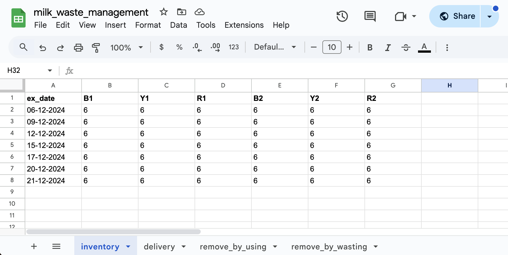

* View inventory menu
    * if choice 1 of the main menu is selected, the submenu to view inventory is displayed and prompt user to select further choice.

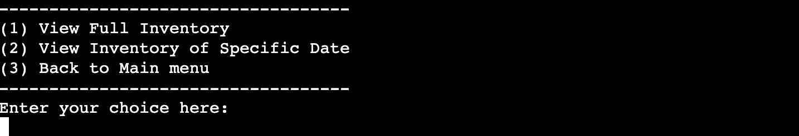

* View Full Inventory
    * If choice 1 of submenu is selected, the application will display a full inventory.

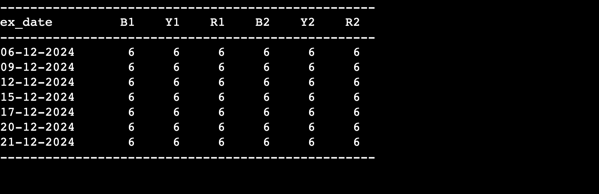

* View Inventory of Specific Date
    * If choice 2 of the submenu is selected, the application will request the expiry date they want to see from the user.
    * The application then display the inventory of the specific date provided by the user.

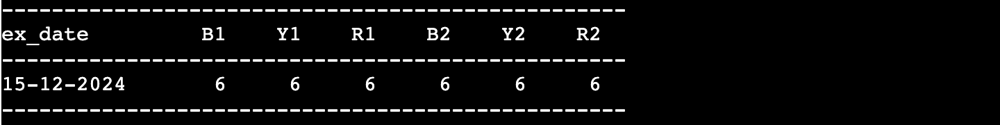

* Exit From Submenu
    * If choice 3 of the submenu is selected, the user will be directed back to main menu.

* Record Delivery
    * If choice 2 of the main menu is selected, the application will request user for delivery data to use for updating worksheets accordingly.The application will also notify user once relevant worksheets are updated.
    * The application will also insert the new expiry date onto remove_by_using and remove_by_wasting worksheets with quantity of 0 for each location for future used.

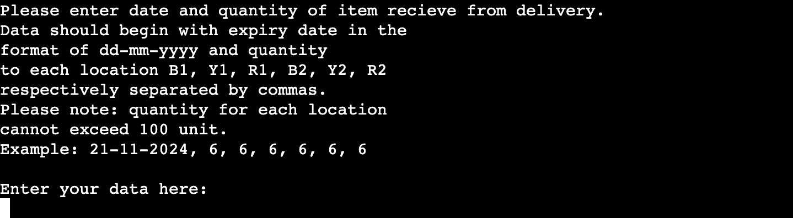
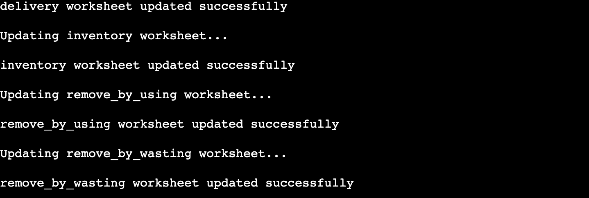

* Record Usage
    * if choice 3 of the main menu is selected, the application will request the expiry date of the milk they will use and the location the milk will be used and how many bottle will be used form the user. The data provided then used to calculate and update remove_by_using and inventory worksheets. 

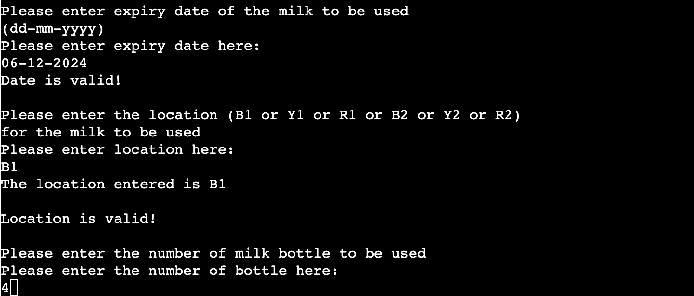
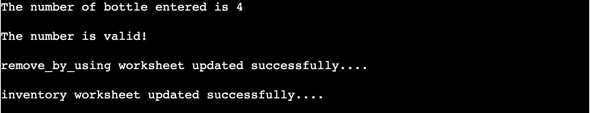

* Record Wastage
    * If choice 4 of the main menu is selected, the application will request the expiry date of the milk they will waste and the location the milk will be wasted and how many bottle will be wasted form the user. The data provided then used to calculate and update remove_by_wasting and inventory worksheets.

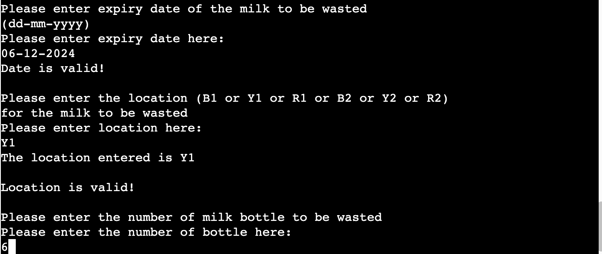
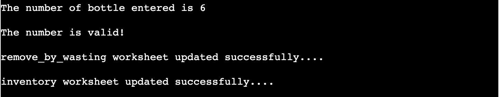

* Record Redistribution
    * If the user wants to record the redistribution of inventory in the case when milk expiry date is soon due and there are still a lot of milk of that expiry date left in certain location that consume less to a location that only has milk that will expire later as all the one soon to expired have been consumed, the user can select choice 5. 
    * When choice 5 is selected, the application will request expiry date of milk the user wants to redistribute, the location redistribute from, quantity of milk redistributing and location milk is redistribute to. The application then update the relevant worksheets with the data provided for accuracy of milk movement recording. 

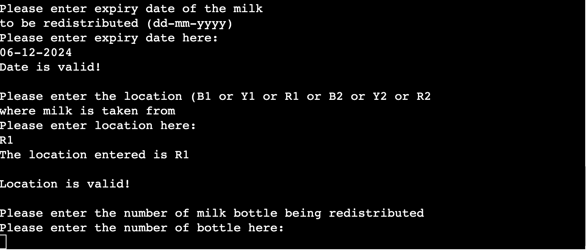

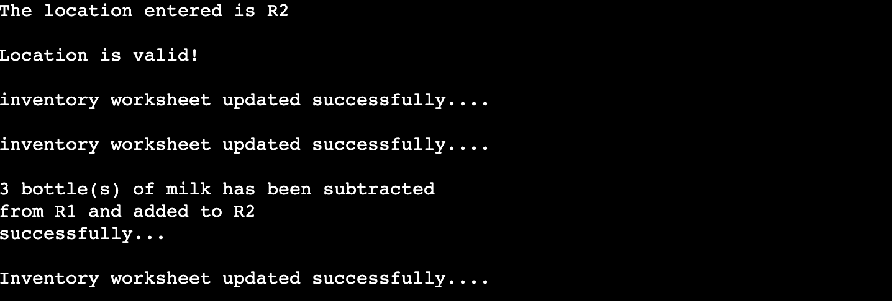

* Exit application
    * If choice 6 is selected, the application will display Exiting and exit the application. 

## Features Left to Implement

* Option to calculate average 5 days usage for next milk order.
* Validation to check and reject if user enter expiry date that has passed the use-by-date.
* Function to automatically erase inventory entry with 0 quantity or expiry date older than current.
* Function to provide statistic of wastage. 

---

## Technologies Used

* [Python](https://en.wikipedia.org/wiki/Python_(programming_language))

---

## Frameworks, Libraries & Programs Used

* [Gitpod](https://www.gitpod.io/)
    * To write the code.
* [Git](https://git-scm.com/)
    * for version control.
* [Github](https://github.com/)
    * Deployment of the website and storing the files online.
* [Lucidchart](https://www.lucidchart.com/)
    * To create a logic flowchart of the application.
* [Heroku](https://www.heroku.com/)
    * To deploy the project.
* [CI Python Linter](https://pep8ci.herokuapp.com/)
    * Check code for any issues.
* [Google Sheets](https://docs.google.com/)
    * To create and store spreadsheet online

## Testing 

CI Python Linter was used to test run.py.

 run.py CI Python Linter check

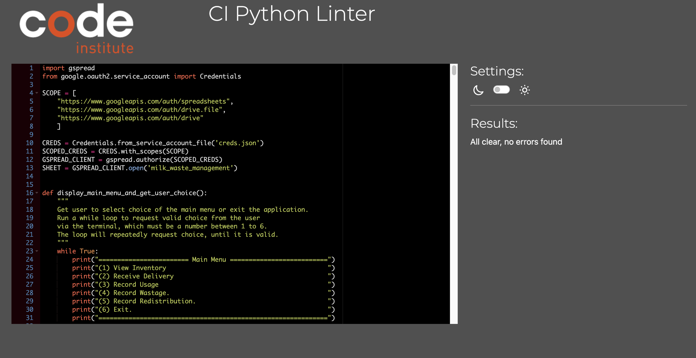

