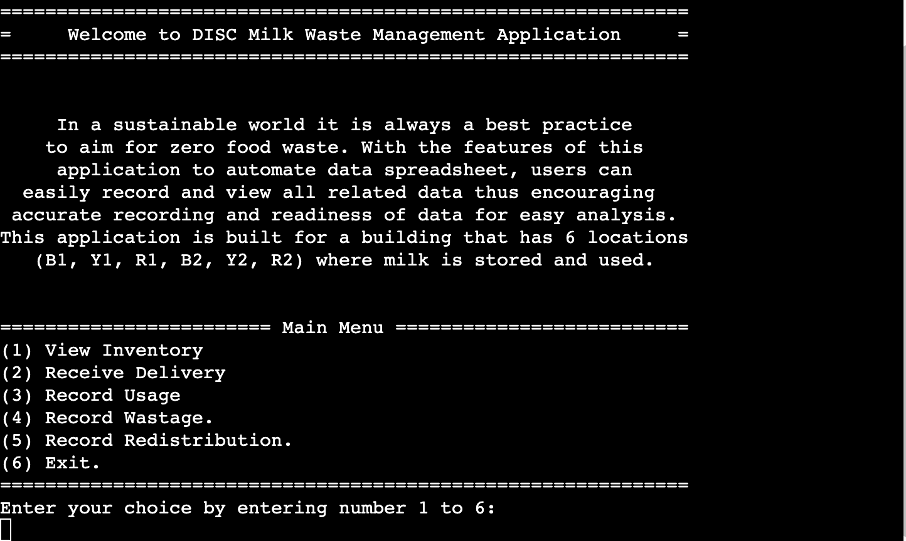
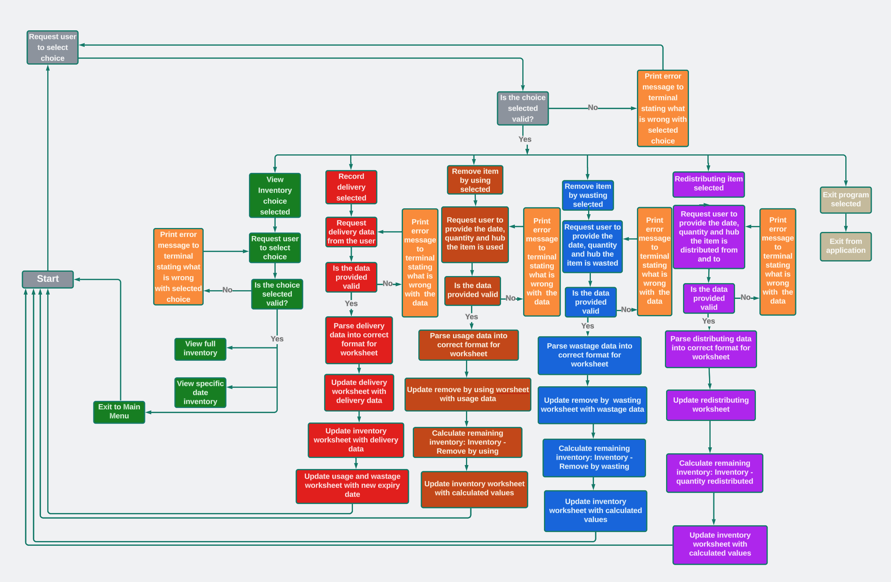

# Milk Waste Management Application

Today sustainability is at the heart of everything we do and decided on. Food waste reduction is one of the main ways an organisation or community needs to practice and highly regard in order for it to be sustainable. Being sustainable also resulted in carbon emission reduction and hence following the concept of the "New World" we live in. 

Milk Waste Management application is designed to aid an organisation or community to meet sustainable goal. The application allow for easy recording of data and thus provide data that is readily available for analysis and drawing up plan that is data driven to gear an organisation towards be sustainable. 

The application is designed to automate editing a google spreadsheet stored on cloud platform that any users with access can view and obtain the stored data for further analysis. User will be able to view inventory, record delivery, record usage, record wastage and record any inventory movement within usage areas through a terminal. Furthermore the ease of use of the application will make waste management and recoding process fun and simple!

[View Milk Waste Management Application live project here](https://milk-waste-management-5ea677ef764f.herokuapp.com/)

[View Milk Waste Management Google Sheets here](https://docs.google.com/spreadsheets/d/1SSIEZcKAZLnjjF3mJlnYxwPEvKTbCURKLN882PISL-U/edit?usp=sharing)

## Table of Contents
### [How to use](#how-to-use-1)
### [Logic Flowchart](#logic-flowchart-1)
### [User Experience (UX)](#user-experience-ux-1)
* [User Stories](#user-stories)
### [Design](#design-1)
### [Features](#features-1)
* [Existing Features](#existing-features)
### [Features Left to Implement](#features-left-to-implement-1)
### [Technologies Used](#technologies-used-1)
### [Frameworks, Libraries & Programs Used](#frameworks-libraries--programs-used-1)
### [Testing](#testing-1)
### [Manual Testing](#manual-testing-1)
### [Input validation testing](#input-validation-testing-1)
### [Fixed Bugs](#fixed-bugs-1)
### [Deployment](#deployment-1)
* [Deployment to Heroku](#deployment-to-heroku)
* [Forking the GitHub Repository](#forking-the-github-repository)
* [Local Clone](#local-clone)
### [Credits](#credits-1)
* [Code](#code)
* [Content](#content)
### [Acknowledgements](#acknowledgements-1)
---

## How to Use

Through Milk Waste Management Application, user can view milk inventory data recoded on linked Google Sheet, record milk delivery, record milk wastage and record milk movement between usage area in a building. The user will be presented with choices they have to select in order to perform certain action. For recording action, user will be prompted to enter data along with guideline on how the data should be entered. The application will also provide respective error messages to guid user to correctly input valid data which will then lead to the selected action being performed to the Google Sheet.

## Logic Flowchart

## User Experience (UX)

The application provided user with clear introduction of the idea behind the design of the application with main menu and instruction to what action should be taken to proceed. Once user selected an action the application will display data or request data as appropriate. The data is displayed in a format that is very easy to understand by the user. The data provided by user is validate with several methods to ensure data provided is valid and of correct format and pattern. The application notify user every time a task is perform successfully and what worksheet has been updated. It is a very simple yet highly capable application to help simplify milk waste management process. 

### User Stories

* First-time visitor goals
    * Understand how to use the application. Clear introduction and instructions are given. Understand the valid format of data be requested through understanding displayed error messages.
    * Use the application. Once the user understands the application, they will likely want to use it.
    * Enjoy the experience. The application should be simple and beneficial to the user. 

* Returning visitor goals
    * Continue using. The returning visitor may have enjoyed using the application and wants to use again.
    * Share with friends and colleagues. Recommend colleagues to give the applcaition a try.
    * Exploring new features, if there is any update. 

* Frequent user goals
    * Switched to updating the spreadsheet through the application over manual updating.
    * Organisation made the use of application mandatory for all employees.
    * Increasing productivity can be seen from using the application.
    * Accuracy of input data is evident.
    * Reduction in wastage amount is evident after a certain period of application usage.
    * Exploring new features, if there is any update.

### Design                          